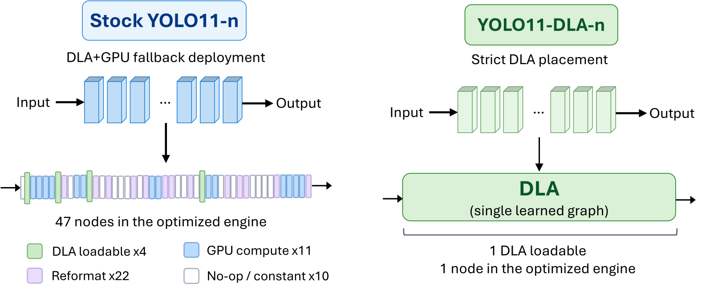
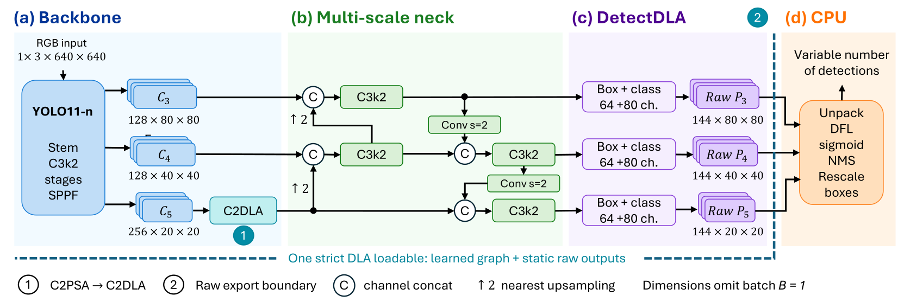
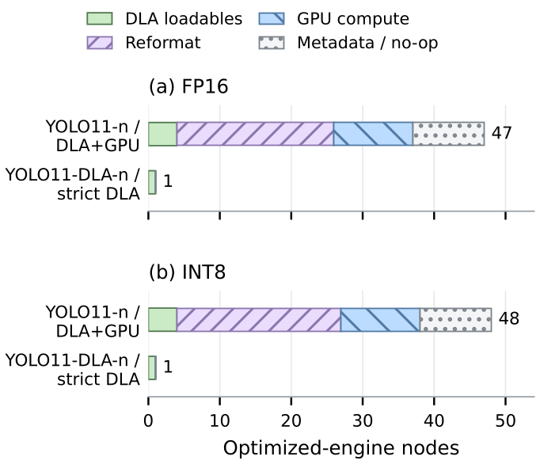
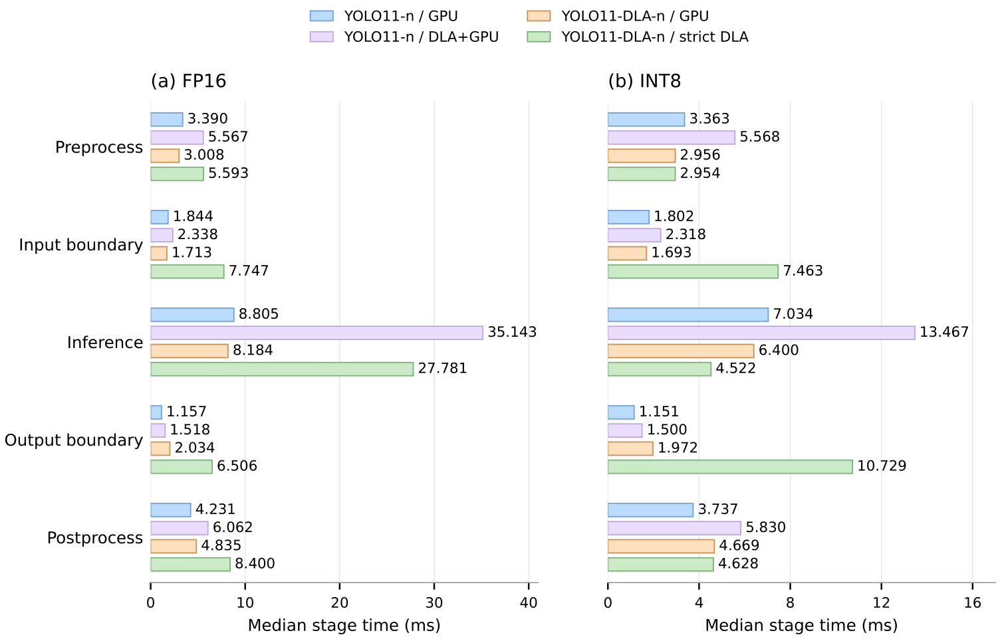
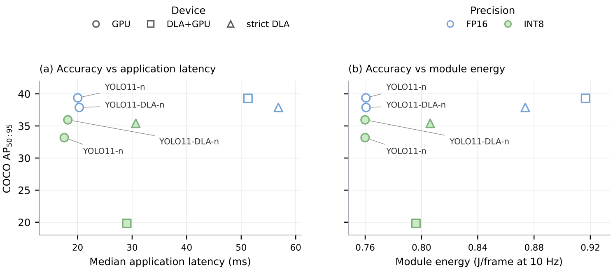

# Fallback-Free Is Not Free: Accuracy, Latency, and Energy Costs of Full DLA Placement for YOLO11

<p align="center">
  
  
  
  
  
</p>

<p align="center">
  Export, deployment, benchmarking and evaluation code, trained weights, and the audited record.
</p>

<p align="center">
  
</p>

<p align="center">
  <em>FP16 deployment. Stock YOLO11-n uses DLA+GPU fallback; YOLO11-DLA-n places the complete learned graph in one DLA loadable.</em>
</p>

Requesting execution on NVIDIA's Deep Learning Accelerator does not mean getting it: TensorRT will compile a DLA engine and silently leave every unsupported region on the GPU. This work asks what it costs to run a modern detector *entirely* on that constrained accelerator, and where the cost falls.

Making YOLO11 fully DLA-admissible takes two localized changes. `C2DLA` replaces spatial self-attention with a channel softmax and a depthwise convolution, and `DetectDLA` exports three static raw prediction maps instead of a decoded tensor. Fallback-disabled compilation and engine inspection then confirm one DLA loadable with no GPU-assigned learned layer, in FP16 and in mixed INT8, on a Jetson AGX Orin with TensorRT 10.3.

It is not free, and the cost is not in the accelerator. In INT8 the inference stage is faster on strict DLA than on the same network on GPU, 4.522 against 6.400 ms, but the native-layout boundaries around it take 7.463 ms on the input and 10.729 ms on the output, each longer than the inference itself. The application pipeline ends up slower and slightly more energy-hungry than the GPU configuration. Boundary cost becomes the binding constraint precisely when the accelerator succeeds.

This repository holds the trained weights and the code to export them, build the TensorRT engines, calibrate INT8, and measure accuracy, latency and module energy. Users of this work should cite:

```bibtex
@unpublished{anonymous2026yolo11dla,
  title   = {Fallback-Free Is Not Free: Accuracy, Latency, and Energy Costs
             of Full DLA Placement for YOLO11},
  author  = {Anonymous Author(s)},
  year    = {2026},
  note    = {Under review}
}
```

This guide treats the repository root as the workspace. Run every command below from that directory unless stated otherwise.

## Table of contents

- [1. Clone the repository](#1-clone-the-repository)
- [2. Install the dependencies](#2-install-the-dependencies)
- [3. What the model changes](#3-what-the-model-changes)
- [4. Export and build the engines](#4-export-and-build-the-engines)
- [5. Verify the placement](#5-verify-the-placement)
- [6. Results](#6-results)
- [7. Reproducing the measurements](#7-reproducing-the-measurements)
- [Evidence](#evidence)
- [Repository layout](#repository-layout)

## 1. Clone the repository

```bash
git clone https://anonymous.4open.science/r/yolo11_dla
cd yolo11_dla
```

The model is a patch to [Ultralytics](https://github.com/ultralytics/ultralytics) and lives in a companion repository: `C2DLA`, `DetectDLA`, the `yolo11-dla` configuration and the host-side decoder, 418 added lines over upstream `a462bb65`. Clone it where the tooling expects it and put that path on `PYTHONPATH`:

```bash
git clone https://anonymous.4open.science/r/ultralytics-dla tools/ultralytics
export PYTHONPATH="$PWD/tools/ultralytics${PYTHONPATH:+:$PYTHONPATH}"
```

## 2. Install the dependencies

Reading the documentation needs nothing. Re-deriving the result tables from the measurement records needs Python 3 and NumPy. Exporting, building engines, calibrating and measuring needs the target board: a Jetson with TensorRT, plus OpenCV, pycocotools and the Ultralytics fork.

Everything was measured on a Jetson AGX Orin Developer Kit with L4T 36.4.4, CUDA 12.6, TensorRT 10.3.0, PyTorch 2.5.0a0 and Python 3.10.12, in NVIDIA's 50 W power mode with `jetson_clocks` disabled, inside a JetPack 6 container. `tegrastats` is not in that image, so the energy runs take it as an explicit `--tegrastats` path. Power rails, container details and the full package list are in [`docs/ENVIRONMENT.md`](docs/ENVIRONMENT.md).

## 3. What the model changes

YOLO11-n's convolutional stem, `C3k2` stages, SPPF, feature-pyramid connections and detection towers are all retained, along with the losses and the assignment. Two substitutions define the adaptation.

<p align="center">
  
</p>

<p align="center">
  <em>Markers 1 and 2 are the two changes. Everything left of the boundary is one DLA loadable; unpacking, decoding and NMS stay on the CPU.</em>
</p>

**`C2PSA → C2DLA`** keeps the split–process–merge wrapper and replaces only the inner attention. A 1×1 projection to a bottleneck is normalized with a softmax **across channels** at each position, a 3×3 depthwise convolution supplies local context, and the two are summed and projected, with a residual and an FFN residual. No spatial affinity matrix, no `MatMul`, no head transpose, no normalization over image positions, and every tensor stays four-dimensional. The stock block instead forms a spatial affinity matrix through a query–key `MatMul` that strict DLA compilation rejects.

**`Detect → DetectDLA`** exports, per pyramid level, the concatenation of the regression and classification towers as a static `1×144×H×W` map at strides 8, 16 and 32, instead of a decoded `1×84×8400` tensor. The DFL expectation, grid decoding, sigmoid, confidence filtering and variable-cardinality NMS all move to the host. During training and ordinary PyTorch inference the inherited `Detect` path still runs, so losses and assignment are unchanged.

Moving the boundary earlier is what makes the graph admissible, and it is also where the cost appears. At FP16 the three raw maps carry 2,419,200 bytes against 1,411,200 for the stock output, a factor of 1.714, and the host then has to pack, unpack and convert them. The decoder recovers part of the cost by filtering on confidence **before** the DFL expectation, which drops the regression work from `O(4rN)` to `O(4rm)` over surviving anchors — median 28.5 of 8,400 in the FP16 10 Hz test — without reducing transfer volume.

## 4. Export and build the engines

Models and measurement artifacts live under `logs/`, which is not tracked: see [`logs/README.md`](logs/README.md) for what each stage expects there and what it writes. The trained checkpoint is the one input this repository cannot regenerate, so it ships directly in [`weights/`](weights/).

```bash
# ONNX: opset 20, static 1x3x640x640, shapes asserted, every artifact hashed
python tools/experiments/run.py prepare \
  --stock /path/to/yolo11n.pt --adapted weights/yolo11-dla-n.pt \
  --hardware-notes tools/experiments/configs/hardware-notes.md --output NEW_DIR

# the strict FP16 engine: no --allowGPUFallback, native DLA I/O formats
trtexec --onnx=weights/yolo11-dla-n.onnx --saveEngine=OUT/adapted-strict-fp16.engine \
        --useDLACore=0 --fp16 \
        --inputIOFormats=fp16:dla_hwc4 --outputIOFormats=fp16:chw16 \
        --profilingVerbosity=detailed --dumpLayerInfo --exportLayerInfo=OUT/adapted-strict-fp16.layers.json \
        --skipInference --verbose
```

INT8 adds a per-model entropy calibration cache, built before fusion from 500 COCO val2017 images sampled with seed 2027, and switches the strict engine's external bindings to `int8:dla_hwc4` and `int8:chw32`. The host then quantizes and dequantizes around the engine using the exact float32 scales extracted from the cache and cross-checked against the build log. All eight build commands, the layout arithmetic and the scales are in [`docs/BUILD.md`](docs/BUILD.md).

## 5. Verify the placement

A successful build proves nothing: `--allowGPUFallback` also succeeds, by partitioning the graph. The claim rests on the optimized-engine inspector, and acceptance means **exactly one DLA node, zero GPU nodes and zero reformat nodes**.

<p align="center">
  
</p>

<p align="center">
  <em>Optimized-engine composition. Precision barely changes the structure: stock YOLO11-n stays partitioned across four DLA loadables with interleaved GPU and reformat nodes, strict YOLO11-DLA-n is one loadable with neither.</em>
</p>

| Model / device | Mode | DLA nodes | Other optimized nodes |
| --- | --- | ---: | --- |
| YOLO11-n / DLA+GPU | FP16 | 4 | 11 GPU compute, 22 reformat, 10 no-op/constant |
| **YOLO11-DLA-n / DLA** | FP16 | **1** | **0** |
| YOLO11-n / strict DLA | FP16 | — | build rejected at the attention `MatMul` |
| YOLO11-n / DLA+GPU | INT8 | 4 | 34, of which 23 reformat |
| **YOLO11-DLA-n / DLA** | INT8 | **1** | **0** |

The FP16 strict build assigns 299 layers to DLA and none to GPU; the INT8 strict build assigns 298 layers to INT8 and one softmax to FP16, all of them on DLA, so fallback-free is not the same as integer-only and the mixed precision stays inside the loadable. The verdicts are read from the inspector output that `--exportLayerInfo` writes next to each engine, and the rejection of the stock strict build is preserved in its own build log; the audited FP16 summary is tracked in [`analysis/engine_summary.csv`](analysis/engine_summary.csv).

## 6. Results

Jetson AGX Orin, batch one, 640×640, 50 W, `jetson_clocks` disabled. `DLA` means strict placement with fallback disabled; `DLA+GPU` is the stock model built with `--allowGPUFallback`. YOLO11-DLA-n on GPU and on strict DLA share the same weights, host decoder and NMS, so their difference isolates placement; anything involving YOLO11-n also mixes architecture, training budget and prediction interface.

**Accuracy**, on 4,500 held-out COCO val2017 images disjoint from the INT8 calibration subset:

| Model | Device | FP16 AP | AP₅₀ | INT8 AP | AP₅₀ |
| --- | --- | ---: | ---: | ---: | ---: |
| YOLO11-n | GPU | 39.378 | 55.190 | 33.175 | 47.324 |
| YOLO11-n | DLA+GPU | 39.308 | 55.160 | 19.827 | 35.241 |
| YOLO11-DLA-n | GPU | 37.879 | 53.633 | 35.951 | 51.063 |
| **YOLO11-DLA-n** | **DLA** | **37.876** | **53.614** | **35.408** | **50.790** |

Placement costs **0.003 AP** in FP16 and **0.543 AP** in INT8 against the same network on GPU, while the precision change costs 2.468 points: the regime, not the placement, dominates the accuracy loss. The stock fallback's collapse to 19.827 AP under INT8 is reported as measured; these tests do not isolate its cause, and the ordering cannot be assumed for other quantization setups.

**Latency**, at two boundaries: `trtexec` engine-plus-transfer over 30 s, and the full application pipeline (preprocessing, native I/O, inference, decode and NMS) over 100 preloaded images for 60 s.

| Model | Device | Mode | Engine median | P95 | Application median | P95 |
| --- | --- | --- | ---: | ---: | ---: | ---: |
| YOLO11-n | GPU | FP16 | 3.740 | 3.753 | 20.030 | 24.658 |
| YOLO11-n | DLA+GPU | FP16 | 34.678 | 34.942 | 51.241 | 59.542 |
| YOLO11-DLA-n | GPU | FP16 | 3.500 | 3.512 | 20.307 | 24.584 |
| YOLO11-DLA-n | DLA | FP16 | 27.515 | 27.718 | 56.820 | 65.042 |
| YOLO11-n | GPU | INT8 | 3.021 | 3.030 | 17.556 | 22.104 |
| YOLO11-n | DLA+GPU | INT8 | 13.068 | 13.094 | 29.020 | 37.510 |
| YOLO11-DLA-n | GPU | INT8 | 2.828 | 2.836 | 18.212 | 22.467 |
| YOLO11-DLA-n | DLA | INT8 | 4.167 | 4.173 | 30.675 | 34.812 |

INT8 cuts strict DLA engine latency by **6.60×**, from 27.515 to 4.167 ms, and beats stock fallback by 3.14×. The application pipeline improves by only **1.85×**, and the ordering reverses: strict is 10.9% slower than fallback in FP16 and 5.7% slower in INT8, while adapted GPU is faster still at 18.212 ms.

<p align="center">
  
</p>

<p align="center">
  <em>Where the time actually goes. Panels use different horizontal scales.</em>
</p>

The stage breakdown is the result. In INT8 the inference stage is faster on strict DLA (4.522 ms) than on the adapted GPU engine (6.400 ms): the accelerator wins the part it is responsible for. The native-layout input boundary then costs 7.463 ms and the output boundary 10.729 ms, each longer than the inference itself, against 1.693 and 1.972 ms for the GPU engine's linear bindings. At FP16 the 27.781 ms inference stage dominated its boundaries and hid them; at INT8 it no longer does. The layout requirement is structural, while the size of the packing and unpacking overhead is specific to this host implementation.

**Module energy**, same 100-image cycle released at 10 Hz for 60 s, 600 frames per configuration with no drop and no miss of the 100 ms deadline, integrating `VDD_GPU_SOC + VDD_CPU_CV + VIN_SYS_5V0`:

| Model | Device | FP16 J/frame | idle-subtracted | INT8 J/frame | idle-subtracted |
| --- | --- | ---: | ---: | ---: | ---: |
| YOLO11-n | GPU | 0.761 | 0.060 | 0.760 | 0.060 |
| YOLO11-n | DLA+GPU | 0.917 | 0.216 | 0.796 | 0.096 |
| YOLO11-DLA-n | GPU | 0.761 | 0.060 | 0.760 | 0.060 |
| YOLO11-DLA-n | DLA | 0.874 | 0.174 | 0.806 | 0.106 |

Strict INT8 is 7.7% below strict FP16 but 6.1% above the same model on GPU, and slightly above its own fallback counterpart, whose accuracy is 15 AP lower. This is module power over three rails, covering the CPU stages around the accelerator, not a measurement of DLA core efficiency.

<p align="center">
  
</p>

<p align="center">
  <em>For every DLA configuration there is a GPU configuration with higher AP, lower application latency and lower module energy. What strict placement provides instead — verified execution with no GPU-assigned learned layer — is not on either axis.</em>
</p>

**What this does not show.** No concurrent GPU workload was measured, so nothing here supports a claim that freeing GPU compute helps another robotic task: strict-DLA traces still reach 7–10% GR3D utilization, and the strict configuration occupies the platform *longer* per frame, so a system-level test with a competing workload is required before any such benefit is claimed. Evidence covers one board, one TensorRT version, one nano detector, 640×640, batch one, and one launch per configuration, so percentiles describe frames within a test and not variability across runs. The exploratory raw GPU/DLA output comparison **fails** its tolerance gate in both precisions and is reported as a diagnostic. Every number, its source file and its caveat are in [`docs/RESULTS.md`](docs/RESULTS.md) and [`docs/PROVENANCE.md`](docs/PROVENANCE.md).

## 7. Reproducing the measurements

The reported values are collected from the measurement records, not typed in. With a campaign under `logs/`, the chain from raw per-frame records to the summaries runs locally:

```bash
# re-derive a results table from the raw per-frame records, and check it against the campaign summary
python tools/experiments/run.py summarize --stage logs/icra2027_int8/run_01/pipeline --output /tmp/check
diff <(sort /tmp/check/results.csv) <(sort logs/icra2027_int8/run_01/pipeline-summary/results.csv)

# rebuild analysis/precision_results.json from the measured CSVs, re-recording their hashes
python tools/experiments/run.py collect-results

# re-audit the FP16 trtexec traces (20,167 timing samples) and rebuild the audit figures
python tools/experiments/run.py audit

# software regression tests for the harness; no accelerator needed, nothing under logs/ required
python -m pytest tools/experiments/tests -q
```

`summarize` reproduces the pipeline, energy and microbenchmark tables byte for byte. It cannot re-aggregate the accuracy stages without their per-image records, but each job's `manifest.json` carries its COCOeval metrics, engine hash, annotation hash and image IDs.

On the board, the five measurement stages run from an already-built engine set and never rebuild one:

```bash
export PAPER_TOOLS="$PWD/tools/experiments" ENG="$PWD/logs/int8_ready" RUN="$PWD/logs/icra2027_int8/run_02"
export COCO_VAL="$PWD/logs/datasets/coco/images/val2017" COCO_ANN="$PWD/logs/datasets/coco/annotations/instances_val2017.json"
bash tools/experiments/datasets/download_coco_val2017.sh

python "$PAPER_TOOLS/run.py" parity   --engines "$ENG" --images "$COCO_VAL" --annotations "$ENG/evaluation.json" --output "$RUN/parity" --limit 50 --raw-diagnostic-only
python "$PAPER_TOOLS/run.py" accuracy --engines "$ENG" --images "$COCO_VAL" --annotations "$ENG/evaluation.json" --output "$RUN/accuracy"
python "$PAPER_TOOLS/run.py" micro    --engines "$ENG" --trtexec /usr/src/tensorrt/bin/trtexec --output "$RUN/micro" --duration 30 --repeats 1
python "$PAPER_TOOLS/run.py" pipeline --engines "$ENG" --images "$COCO_VAL" --annotations "$COCO_ANN" --output "$RUN/pipeline" --limit 100 --duration 60 --repeats 1
python "$PAPER_TOOLS/run.py" energy   --engines "$ENG" --images "$COCO_VAL" --annotations "$COCO_ANN" --output "$RUN/energy-10hz" \
       --limit 100 --fps 10 --duration 60 --repeats 1 --tegrastats /tmp/tegrastats-paper --power-profile agx-orin
```

Every stage needs a new output directory, has no resume, verifies engine hashes before measuring, and accepts `--dry-run`. The full protocol is in [`docs/EXPERIMENTS.md`](docs/EXPERIMENTS.md).

## Evidence

Models are in [`weights/`](weights/), measurement output goes to `logs/`, and [`analysis/`](analysis/) holds the audited summaries the published numbers were taken from, each recording the SHA-256 of the file it was computed from.

The hash chain runs from the checkpoint to the measured engine: the checkpoint hash is in the training extract, the ONNX hash in the calibration manifests, the cache hash in the quantization sidecar, and the engine hash in every measurement manifest. A re-run that lands on the same hashes is measuring the same artifacts.

## Repository layout

```
docs/                     architecture, environment, build, protocol, results map, provenance
tools/
├── experiments/          export, calibration, build, verification, measurement, summarization
│   ├── int8/             split, calibration, build, registration, native scales
│   ├── evaluation/       COCO AP, ONNX verification, layout and decoder validation
│   ├── benchmarks/       runtime, pacing, telemetry
│   ├── orchestration/    the build and measurement matrix
│   ├── analysis/         log audit, checkpoint history, summaries and figures
│   ├── training/         the trainer used for the released checkpoint
│   └── history/          command archive and recovered provenance
└── ultralytics/          the model fork: C2DLA, DetectDLA, host decoder, model YAML
analysis/                 the audited record, hash-linked to the campaign artifacts
weights/                  the trained checkpoint and its ONNX export
logs/                     untracked: engines and measurement campaigns live here
```

## Copyright and License

Copyright 2026 Anonymous Author

Licensed under the Apache License, Version 2.0 (the "License"); you may not use this file except in compliance with the License.

You may obtain a copy of the License at <http://www.apache.org/licenses/LICENSE-2.0>.

Unless required by applicable law or agreed to in writing, software distributed under the License is distributed on an "AS IS" BASIS, WITHOUT WARRANTIES OR CONDITIONS OF ANY KIND, either express or implied.

See the License for the specific language governing permissions and limitations under the License.
