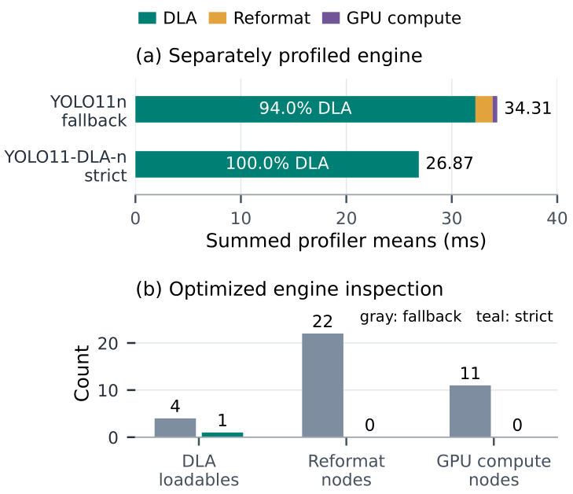
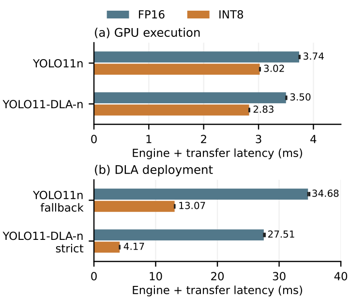

# YOLO11-DLA: Fallback-Free Object Detection on NVIDIA DLA for Embedded Robotic Perception

<p align="center">
  
  
  
  
  
</p>

<p align="center">
  Reference model, measurement harness and audited record.
</p>

<p align="center">
  
</p>

<p align="center">
  <em>The same detector family, compiled for DLA core 0 in FP16.</em>
</p>

Dedicated neural accelerators give an embedded robot somewhere else to put perception, but a detector *targeted* at the NVIDIA Deep Learning Accelerator can still run largely on the GPU: TensorRT will happily compile a DLA engine and silently fall back for every operator it cannot place. YOLO11-DLA replaces the two constructs that block placement — spatial self-attention becomes input-dependent channel mixing with local depthwise context, and the decoded prediction interface becomes three static raw maps — so that on a Jetson AGX Orin with TensorRT 10.3 **the complete learned graph compiles into one DLA loadable with GPU fallback disabled**, in FP16 and in calibrated INT8, with **37.876 AP** and **35.408 AP** on 4,500 held-out COCO images. Stock YOLO11n does not compile at all under the same constraint.

The result that matters for robotics is the one that cuts the other way: strict placement wins at the engine boundary and **loses at the application boundary**, because native I/O packing and INT8 conversion move onto the CPU. This repository reports both.

It provides the model configuration, the export/build/calibration tooling, the measurement harness for accuracy, latency and module energy, the manuscript sources, and the audited record behind every number in the paper — each summary hash-linked to the raw artifact it was computed from, and each protocol documented well enough to run again. Users of YOLO11-DLA should cite:

```bibtex
@unpublished{anonymous2026yolo11dla,
  title   = {YOLO11-DLA: Fallback-Free Object Detection on NVIDIA DLA
             for Embedded Robotic Perception},
  author  = {Anonymous Author(s)},
  year    = {2026},
  note    = {Under review}
}
```

This guide treats the repository root as the workspace. Run every command below from that directory unless stated otherwise.

## Table of contents

- [1. Clone the repository](#1-clone-the-repository)
- [2. Install the dependencies](#2-install-the-dependencies)
- [3. What the model changes](#3-what-the-model-changes)
- [4. Export and build the engines](#4-export-and-build-the-engines)
- [5. Verify the placement](#5-verify-the-placement)
- [6. Results](#6-results)
- [7. Reproducing the paper](#7-reproducing-the-paper)
- [Evidence](#evidence)
- [Repository layout](#repository-layout)

## 1. Clone the repository

```bash
git clone https://anonymous.4open.science/r/yolo11_dla
cd yolo11_dla
```

The model itself is a patch to [Ultralytics](https://github.com/ultralytics/ultralytics) and lives in a companion repository — `C2DLA`, `DetectDLA`, the `yolo11-dla` configuration and the host-side decoder, 229 added lines over upstream `a462bb65`. Clone it where the tooling expects it and put that path on `PYTHONPATH`:

```bash
git clone https://anonymous.4open.science/r/ultralytics-dla tools/ultralytics
export PYTHONPATH="$PWD/tools/ultralytics${PYTHONPATH:+:$PYTHONPATH}"
```

[`docs/MODEL_PATCH.md`](docs/MODEL_PATCH.md) documents that patch change by change, including what was deliberately left out, so it can also be reapplied to a plain upstream checkout. Reading the documentation, regenerating the tables and rebuilding the manuscript do not need the fork at all.

## 2. Install the dependencies

Three levels of dependency, depending on how far you want to go. Reading the protocol and the audited record needs nothing at all; re-deriving the summary tables from a campaign's raw records needs Python and NumPy; running anything that loads an engine needs the target board.

The measurements ran inside a JetPack 6 container on the board, with the repository bind-mounted into it. `tegrastats` is not present in that image, so the energy campaigns used a copy of the host binary passed explicitly with `--tegrastats`; see [`docs/ENVIRONMENT.md`](docs/ENVIRONMENT.md).

| Task | Needs |
| --- | --- |
| Read the protocol, the audits and the manuscript | nothing |
| Re-derive result tables from the raw records | Python 3, [NumPy](https://numpy.org) |
| Regenerate tables and figures | plus [Matplotlib](https://matplotlib.org) |
| Re-extract the checkpoint history, verify the export | plus [PyTorch](https://pytorch.org), [ONNX](https://onnx.ai) and ONNX Runtime |
| Rebuild the manuscript | [Tectonic](https://tectonic-typesetting.github.io), and [PyMuPDF](https://pymupdf.readthedocs.io) for the preflight |
| Run the test suite | [pytest](https://docs.pytest.org) |
| Export, build, calibrate, measure | a Jetson with TensorRT, [OpenCV](https://opencv.org), [pycocotools](https://github.com/ppwwyyxx/cocoapi) and the Ultralytics fork |

The measured stack is L4T 36.4.4, CUDA 12.6, TensorRT 10.3.0.30, cuDNN 9.3.0, PyTorch 2.5.0a0, Python 3.10.12, ROS 2 Jazzy, in NVIDIA's 50 W power mode with `jetson_clocks` disabled. Full details, including the power-rail topology, are in [`docs/ENVIRONMENT.md`](docs/ENVIRONMENT.md).

## 3. What the model changes

YOLO11n's convolutional stem, `C3k2` stages, SPPF, feature-pyramid connections and detection towers are all retained. Two substitutions define the adaptation.

<p align="center">
  
</p>

<p align="center">
  <em>Markers 1 and 2 are the two changes. Everything left of the boundary is one DLA loadable; unpacking, decoding and NMS stay on the CPU.</em>
</p>

**`C2PSA → C2DLA`** keeps the split–process–merge wrapper and replaces only the inner attention. A 1×1 projection to a bottleneck is normalized with a softmax **across channels** at each position, a 3×3 depthwise convolution supplies local context, and the two are summed and projected, with a residual and an FFN residual. No spatial affinity matrix, no `MatMul`, no head transpose, no normalization over image positions, and every tensor stays four-dimensional. The stock block instead fails strict compilation at its attention `MatMul`, which DLA does not support.

**`Detect → DetectDLA`** exports, per pyramid level, the concatenation of the regression and classification towers as a static `1×144×H×W` map at strides 8, 16 and 32, instead of a decoded `1×84×8400` tensor. The DFL expectation, grid decoding, sigmoid, confidence filtering and variable-cardinality NMS all move to the host. During training and ordinary PyTorch inference the inherited `Detect` path still runs, so losses and assignment are unchanged.

The boundary is not free: at FP16 the three raw maps carry 2,419,200 bytes against 1,411,200 for the stock output, a factor of 1.714. The host decoder recovers part of that by filtering on confidence **before** the DFL expectation, which drops the regression work from `O(4rN)` to `O(4rm)` over surviving anchors — median 28.5 of 8,400 in the FP16 10 Hz test — without reducing transfer volume.

The nano model is initialized from `yolo11n.pt` by intersecting the state dictionaries on name and shape, then fine-tuned for 500 epochs on COCO train2017 at 640×640, batch 32, seed 0, AMP, with mosaic closed for the last ten epochs. Full derivation, including the reconstruction of the automatically selected optimizer, is in [`docs/ARCHITECTURE.md`](docs/ARCHITECTURE.md).

## 4. Export and build the engines

Models and measurement artifacts live under `logs/`, which is not tracked: see [`logs/README.md`](logs/README.md) for what each stage expects there and what it writes. The trained checkpoint is the one input this repository cannot regenerate — everything else follows from it.

```bash
# ONNX: opset 20, static 1x3x640x640, shapes asserted, every artifact hashed
python tools/experiments/run.py prepare \
  --stock /path/to/yolo11n.pt --adapted weights/yolo11-dla-n.pt \
  --hardware-notes tools/experiments/configs/hardware-notes.md --output NEW_DIR

# the strict FP16 engine: no --allowGPUFallback, native DLA I/O formats
trtexec --onnx=weights/yolo11-dla-n.onnx --saveEngine=OUT/adapted-strict-fp16.engine \
        --useDLACore=0 --fp16 \
        --inputIOFormats=fp16:dla_hwc4 --outputIOFormats=fp16:chw16 \
        --profilingVerbosity=detailed --dumpLayerInfo --exportLayerInfo=OUT/adapted-strict-fp16.layers.json \
        --skipInference --verbose
```

INT8 adds a per-model entropy calibration cache, built before fusion from 500 COCO val2017 images sampled with seed 2027, and switches the strict engine's external bindings to `int8:dla_hwc4` and `int8:chw32`. The host then quantizes and dequantizes around the engine using the exact float32 scales extracted from the cache and cross-checked against the build log. All eight build commands, the layout arithmetic and the scales are in [`docs/BUILD.md`](docs/BUILD.md).

## 5. Verify the placement

A successful build proves nothing: `--allowGPUFallback` also succeeds, by partitioning the graph. The claim rests on the optimized-engine inspector, and acceptance means **exactly one DLA node, zero GPU nodes and zero reformat nodes**.

| Model / device | Mode | DLA nodes | Other optimized nodes |
| --- | --- | ---: | --- |
| 11n / DLA+GPU | FP16 | 4 | 11 GPU compute, 22 reformat, 10 no-op/constant |
| **11-DLA / DLA** | FP16 | **1** | **0** |
| 11n / strict DLA | FP16 | — | build rejected at the attention `MatMul` |
| 11n / DLA+GPU | INT8 | 4 | 34, of which 23 reformat |
| **11-DLA / DLA** | INT8 | **1** | **0** |

The FP16 strict build assigns 299 layers to DLA and none to GPU; the INT8 strict build assigns 298 layers to INT8 and one softmax to FP16, all of them on DLA — fallback-free is not the same as integer-only. The verdicts above are read from the inspector output that `--exportLayerInfo` writes next to each engine, and the rejection of the stock strict build is preserved in its own build log; the audited FP16 summary, including the loadable and reformat counts, is tracked in [`tools/paper/analysis/engine_summary.csv`](tools/paper/analysis/engine_summary.csv).

<p align="center">
  
</p>

<p align="center">
  <em>FP16 only. The stock fallback engine spends 93.97% of its separate layer profile inside DLA segments, 4.73% in reformats and 1.30% in GPU compute — partitioned, not placed.</em>
</p>

## 6. Results

Jetson AGX Orin, batch one, 640×640. `11n` is stock YOLO11n, `11-DLA` is YOLO11-DLA-n; `DLA` is strict placement, `DLA+GPU` is the stock model with fallback allowed.

**Accuracy**, on 4,500 held-out COCO val2017 images disjoint from the INT8 calibration subset:

| Model / device | FP16 AP | AP₅₀ | INT8 AP | AP₅₀ |
| --- | ---: | ---: | ---: | ---: |
| 11n / GPU | 39.378 | 55.190 | 33.175 | 47.324 |
| 11n / DLA+GPU | 39.308 | 55.160 | 19.827 | 35.241 |
| 11-DLA / GPU | 37.879 | 53.633 | 35.951 | 51.063 |
| **11-DLA / DLA** | **37.876** | **53.614** | **35.408** | **50.790** |

Placement costs **0.003 AP** in FP16 and **0.543 AP** in INT8 against the same model on GPU: the negligible FP16 difference does not carry over. The stock fallback's collapse to 19.827 AP under INT8 is reported as measured, not as an isolated causal finding — architecture, training budget and calibration all differ.

**Latency**, at two different boundaries. `trtexec` engine-plus-transfer on the left, the full application pipeline — preprocessing, native I/O, inference, decode and NMS over 100 preloaded images for 60 s — on the right:

| Model / device | Mode | Engine+I/O median | Rate | Pipeline median | P99 | Rate |
| --- | --- | ---: | ---: | ---: | ---: | ---: |
| 11n / GPU | FP16 | 3.740 ms | 288.3 q/s | 20.030 ms | 27.702 ms | 47.99 fps |
| 11n / DLA+GPU | FP16 | 34.678 ms | 29.2 q/s | 51.241 ms | 64.478 ms | 18.95 fps |
| 11-DLA / GPU | FP16 | 3.500 ms | 317.2 q/s | 20.307 ms | 28.591 ms | 47.63 fps |
| 11-DLA / DLA | FP16 | **27.515 ms** | 37.2 q/s | 56.820 ms | 76.886 ms | 17.19 fps |
| 11n / GPU | INT8 | 3.021 ms | 357.0 q/s | 17.556 ms | 23.681 ms | 54.70 fps |
| 11n / DLA+GPU | INT8 | 13.068 ms | 79.5 q/s | 29.020 ms | 40.293 ms | 32.71 fps |
| 11-DLA / GPU | INT8 | 2.828 ms | 393.4 q/s | 18.212 ms | 23.780 ms | 53.00 fps |
| 11-DLA / DLA | INT8 | **4.167 ms** | 263.7 q/s | 30.675 ms | 36.322 ms | 31.93 fps |

<p align="center">
  
</p>

<p align="center">
  <em>Medians with whiskers to P95; the two panels use different horizontal scales.</em>
</p>

INT8 gives strict DLA a **6.60× engine speedup** and beats stock fallback by 3.14×. **The ordering then reverses at the application boundary**: strict is 10.9% slower than fallback in FP16 and 5.7% slower in INT8. The INT8 stage medians say why — 7.463 ms packing, quantization and H2D, 4.522 ms in the engine, 10.729 ms output transfer, unpacking and dequantization, 4.628 ms post-processing, against 2.318 / 13.467 / 1.500 / 5.830 ms for fallback. Native I/O processing on the CPU is a first-order cost, and the 1.85× pipeline speedup INT8 does deliver is far short of the 6.60× at the engine.

**Module energy**, same 100-image cycle released at 10 Hz for 60 s, 600 frames completed per configuration with no drop and no miss of the 100 ms deadline, integrating `VDD_GPU_SOC + VDD_CPU_CV + VIN_SYS_5V0`:

| Model / device | FP16 power | J/frame | INT8 power | J/frame |
| --- | ---: | ---: | ---: | ---: |
| 11n / GPU | 7.605 W | 0.761 | 7.599 W | 0.760 |
| 11n / DLA+GPU | 9.166 W | 0.917 | 7.961 W | 0.796 |
| 11-DLA / GPU | 7.606 W | 0.761 | 7.599 W | 0.760 |
| 11-DLA / DLA | 8.738 W | 0.874 | 8.062 W | 0.806 |

Strict INT8 is 7.7% below strict FP16 but 6.1% above the same model on GPU, and slightly above its own fallback counterpart — whose accuracy is 15 AP lower. Module power, three rails, not wall-plug.

**What this does not show.** No concurrent GPU workload was measured, so nothing here supports a claim of resource isolation or of recovered GPU capacity for another robotic task; strict-DLA traces still reach 7–10% GR3D utilization. Evidence covers one board, one TensorRT version, the nano scale, detection only, 640×640, batch one, and one launch per configuration, so percentiles describe frames within a test and not variability across runs. The exploratory raw GPU/DLA output comparison **fails** its tolerance gate in both precisions and is reported as a diagnostic. Every number, its source file and its caveat are in [`docs/RESULTS.md`](docs/RESULTS.md) and [`docs/PROVENANCE.md`](docs/PROVENANCE.md).

## 7. Reproducing the paper

The manuscript tables are generated, not typed. With a campaign present under `logs/`, the whole chain from raw records to typeset table runs locally:

```bash
# re-derive a results table from the raw per-frame records, and check it against the campaign summary
python tools/experiments/run.py summarize --stage logs/icra2027_int8/run_01/pipeline --output /tmp/check
diff <(sort /tmp/check/results.csv) <(sort logs/icra2027_int8/run_01/pipeline-summary/results.csv)

# regenerate the four manuscript tables and the latency figure from the measured CSVs
make -C tools/paper precision-results

# re-audit the FP16 trtexec traces (20,167 timing samples) and rebuild the audit figures
python tools/experiments/run.py audit

# rebuild the manuscript and run the PDF preflight
make -C tools/paper

# software regression tests for the harness; no accelerator needed, nothing under logs/ required
python -m pytest tools/experiments/tests -q
```

That re-derivation reproduces byte-identically for the pipeline, energy and microbenchmark stages. The accuracy stages are the exception: `summarize` reads their bulk per-image records, but each job's own `manifest.json` carries the full COCOeval metrics, the engine hash, the annotation hash and the evaluated image IDs, so every accuracy row stays checkable without them.

Without a campaign, the audited record is still tracked: [`tools/paper/analysis/`](tools/paper/analysis/) holds the summaries the manuscript was built from, each with the SHA-256 of the raw file it came from, so the published numbers can be tied to a future re-run.

On the board, the five measurement stages run from an already-built engine set and never rebuild one:

```bash
export PAPER_TOOLS="$PWD/tools/experiments" ENG="$PWD/logs/int8_ready" RUN="$PWD/logs/icra2027_int8/run_02"
export COCO_VAL="$PWD/logs/datasets/coco/images/val2017" COCO_ANN="$PWD/logs/datasets/coco/annotations/instances_val2017.json"
bash tools/experiments/datasets/download_coco_val2017.sh

python "$PAPER_TOOLS/run.py" parity   --engines "$ENG" --images "$COCO_VAL" --annotations "$ENG/evaluation.json" --output "$RUN/parity" --limit 50 --raw-diagnostic-only
python "$PAPER_TOOLS/run.py" accuracy --engines "$ENG" --images "$COCO_VAL" --annotations "$ENG/evaluation.json" --output "$RUN/accuracy"
python "$PAPER_TOOLS/run.py" micro    --engines "$ENG" --trtexec /usr/src/tensorrt/bin/trtexec --output "$RUN/micro" --duration 30 --repeats 1
python "$PAPER_TOOLS/run.py" pipeline --engines "$ENG" --images "$COCO_VAL" --annotations "$COCO_ANN" --output "$RUN/pipeline" --limit 100 --duration 60 --repeats 1
python "$PAPER_TOOLS/run.py" energy   --engines "$ENG" --images "$COCO_VAL" --annotations "$COCO_ANN" --output "$RUN/energy-10hz" \
       --limit 100 --fps 10 --duration 60 --repeats 1 --tegrastats /tmp/tegrastats-paper --power-profile agx-orin
```

Every stage wants a **new** output directory, has no resume, verifies engine hashes before measuring, and accepts `--dry-run` to print its command list without importing CUDA. The full protocol, with the thresholds that differ between the accuracy and the application settings, is in [`docs/EXPERIMENTS.md`](docs/EXPERIMENTS.md).

## Evidence

Models, engines and measurement artifacts live under `logs/`, which is **not tracked** — the two campaigns behind the paper are about 164 MB, and the per-image COCO prediction dumps behind them are several gigabytes more. [`logs/README.md`](logs/README.md) documents what every stage expects there and what it writes.

What the repository does carry is the **derived** record, in [`tools/paper/analysis/`](tools/paper/analysis/), each file hash-linked to the raw artifact it was computed from:

| File | Contents |
| --- | --- |
| `precision_results.json` | the four manuscript tables, with the SHA-256 of the eight campaign CSVs they were generated from |
| `engine_summary.csv` | the audited FP16 engine summary: 20,167 timing samples, engine sizes, DLA loadables, GPU and reformat node counts |
| `layer_profile.csv`, `fp16_audit.json` | the per-layer FP16 profile and the full raw-log audit |
| `checkpoint_training.json`, `.csv` | the training configuration and the 500-epoch history read back from the checkpoint, with its SHA-256 |
| `model_verification.json` | the deterministic CPU ONNX and decoder verification, with operator counts and errors |
| `paper_preflight.json` | the PDF format check of the submitted manuscript |

The chain from weights to measured engine is stated as hashes across these files and reproduced by each campaign's own manifests: the checkpoint hash appears in the training extract, the ONNX hash in the calibration manifests, the cache hash in the quantization sidecar, and the engine hash in every measurement manifest and accuracy summary. A re-run that lands on the same hashes is measuring the same artifacts.

The trained checkpoint is the one input this repository cannot regenerate, since it is 500 epochs of COCO training, so it ships directly in [`weights/`](weights/) together with its ONNX export.

## Repository layout

```
docs/                     architecture, environment, build, protocol, results map, provenance
tools/
├── experiments/          export, calibration, build, verification, measurement, summarization
│   ├── int8/             split, calibration, build, registration, native scales
│   ├── evaluation/       COCO AP, ONNX verification, layout and decoder validation
│   ├── benchmarks/       runtime, pacing, telemetry
│   ├── orchestration/    the build and measurement matrix
│   ├── analysis/         log audit, checkpoint history, summaries and figures
│   ├── training/         the trainer used for the released checkpoint
│   └── history/          command archive and recovered provenance
├── paper/                manuscript, generated tables and figures, preserved audits
└── ultralytics/          the model fork: C2DLA, DetectDLA, host decoder, model YAML
weights/                  the trained checkpoint and its ONNX export
logs/                     untracked: engines and measurement campaigns live here
```

## Copyright and License

Copyright 2026 Anonymous Author

Licensed under the Apache License, Version 2.0 (the "License"); you may not use this file except in compliance with the License.

You may obtain a copy of the License at <http://www.apache.org/licenses/LICENSE-2.0>.

Unless required by applicable law or agreed to in writing, software distributed under the License is distributed on an "AS IS" BASIS, WITHOUT WARRANTIES OR CONDITIONS OF ANY KIND, either express or implied.

See the License for the specific language governing permissions and limitations under the License.
